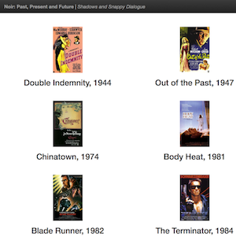

# README

<a href="https://www.udacity.com/">
	
</a>

**Udacity Full Stack Web Developer Nanodegree program**

Project 1. Python web server

Brendon Smith

br3ndonland

## TOC
<!-- START doctoc generated TOC please keep comment here to allow auto update -->
<!-- DON'T EDIT THIS SECTION, INSTEAD RE-RUN doctoc TO UPDATE -->
**Table of Contents**  *generated with [DocToc](https://github.com/thlorenz/doctoc)*

- [Description](#description)
- [Movies on the site](#movies-on-the-site)
- [Directory contents](#directory-contents)
- [Instructions](#instructions)

<!-- END doctoc generated TOC please keep comment here to allow auto update -->


## Description

Python code that stores a list of movies, including artwork and trailers, and serves the data to a local webpage with HTML and CSS.




## Movies on the site

Film noir is one of my favorite genres. I decided to include two classic noir films, two neo noir films (in the film noir style, set in the noir era, but made more recently), and two future noir films (containing elements of film noir, but set in the future). 

| Noir era | Movie 1 | Date | Movie 2 | Date |
|:-------|:------|:------|:------|:------|
| *Classic Noir* | Double Indemnity | 1944 | Out of the Past | 1947 |
| *Neo Noir* | Chinatown | 1974 | Body Heat | 1981|
| *Future Noir* | Blade Runner | 1982 | The Terminator | 1984 |


## Directory contents

1. *media.py* contains the class definition used to provide movie information.
2. *fresh_tomatoes_noir.py* calls a Bootstrap 3 template and contains HTML, CSS, and Python code to build the site
3. *noir.py* imports the above two files, provides movie information, and calls the `open_movies_page` function to build and open the site.


## Instructions

1. On the command line, change into the directory containing the files.
2. Run *noir.py* to build the site.

```
$ cd path
$ python noir.py
```

[(Back to TOC)](#toc)